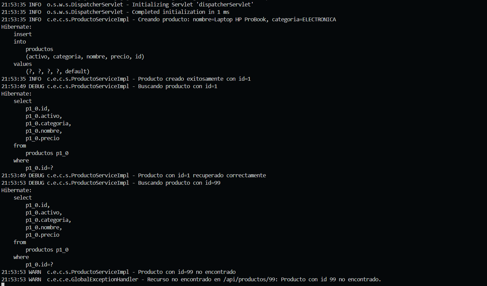
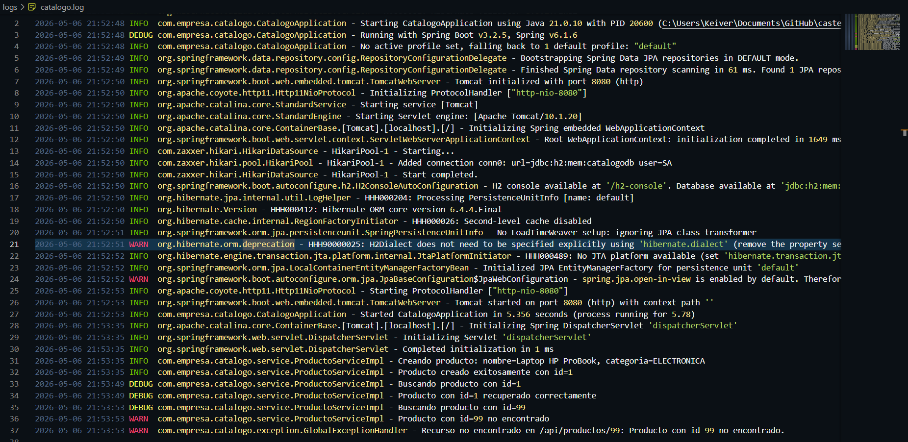
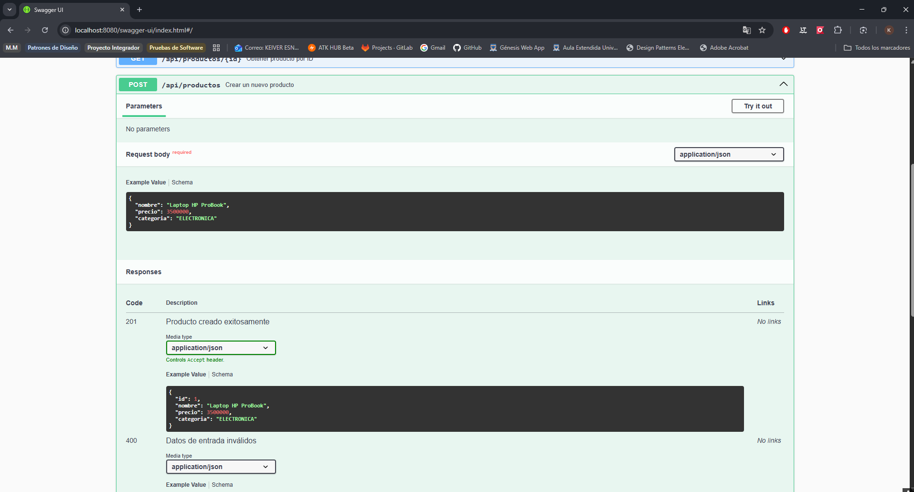

# API Catálogo de Productos — Logging y Documentación

> **UDES · Ingeniería de Sistemas 2026**  
> Programación Web · Unidad 11 · Post-Contenido 2  
> Logging con SLF4J/Logback y Documentación con Swagger/OpenAPI

---

## Objetivo

Integrar SLF4J/Logback en la aplicación Spring Boot del Post-Contenido 1 para registrar eventos con niveles apropiados y rotación de archivos, y documentar la API REST completa con springdoc-openapi generando una Swagger UI interactiva.

---

## Tecnologías y Versiones

| Tecnología        | Versión                             |
| ----------------- | ----------------------------------- |
| Java              | 21                                  |
| Spring Boot       | 3.2.5                               |
| Maven             | 3.9.x                               |
| springdoc-openapi | 2.3.0                               |
| SLF4J + Logback   | incluido en spring-boot-starter-web |
| H2 Database       | runtime (en memoria)                |
| IDE               | VS Code                             |
| SO                | Windows 11                          |

---

## Arquitectura del Proyecto

```
castellanos-post2-u11/
├── src/main/
│   ├── java/com/empresa/catalogo/
│   │   ├── CatalogoApplication.java      ← @OpenAPIDefinition
│   │   ├── controller/
│   │   │   └── ProductoController.java   ← @Tag, @Operation, @ApiResponse
│   │   ├── service/
│   │   │   ├── ProductoService.java      ← interfaz
│   │   │   └── ProductoServiceImpl.java  ← SLF4J Logger (INFO/DEBUG/WARN)
│   │   ├── dto/
│   │   │   ├── ProductoRequestDTO.java   ← @Schema en todos los campos
│   │   │   └── ProductoResponseDTO.java  ← @Schema en todos los campos
│   │   ├── entity/
│   │   │   └── Producto.java
│   │   ├── factory/
│   │   │   └── ProductoFactory.java
│   │   ├── repository/
│   │   │   └── ProductoRepository.java
│   │   └── exception/
│   │       ├── GlobalExceptionHandler.java
│   │       ├── RecursoNoEncontradoException.java
│   │       └── ApiError.java
│   └── resources/
│       ├── application.properties        ← rutas springdoc
│       └── logback-spring.xml            ← CONSOLA + ARCHIVO con rotación
├── capturas/                             ← evidencia de los checkpoints
├── logs/                                 ← generado en ejecución (.gitignore)
├── .gitignore
└── pom.xml
```

---

## Prerrequisitos

- Java 21 instalado y `JAVA_HOME` configurado
- Maven 3.9.x disponible en `PATH`
- Git Bash o PowerShell
- Puerto 8080 libre

---

## Ejecución Paso a Paso

### 1. Clonar el repositorio

```bash
git clone https://github.com/<usuario>/castellanos-post2-u11.git
cd castellanos-post2-u11
```

### 2. Compilar el proyecto

```bash
mvn clean compile
```

### 3. Ejecutar la aplicación

```bash
mvn spring-boot:run
```

### 4. Verificar que la aplicación inició

Buscar en consola:

```
Started CatalogoApplication in X.XXX seconds
```

---

## Acceso a Swagger UI

| URL                                     | Descripción                     |
| --------------------------------------- | ------------------------------- |
| `http://localhost:8080/swagger-ui.html` | Interfaz Swagger UI interactiva |
| `http://localhost:8080/api-docs`        | JSON OpenAPI 3 en crudo         |
| `http://localhost:8080/h2-console`      | Consola H2 (solo desarrollo)    |

---

## Endpoints Documentados

| Método   | URL                   | Descripción                       | Respuestas |
| -------- | --------------------- | --------------------------------- | ---------- |
| `GET`    | `/api/productos`      | Lista todos los productos activos | 200        |
| `GET`    | `/api/productos/{id}` | Obtiene un producto por ID        | 200, 404   |
| `POST`   | `/api/productos`      | Crea un nuevo producto            | 201, 400   |
| `DELETE` | `/api/productos/{id}` | Elimina un producto por ID        | 204, 404   |

### Ejemplo de Request — POST `/api/productos`

```json
{
  "nombre": "Laptop HP ProBook",
  "precio": 3500000.0,
  "categoria": "ELECTRONICA"
}
```

### Ejemplo de Response — 201 Created

```json
{
  "id": 1,
  "nombre": "Laptop HP ProBook",
  "precio": 3500000.0,
  "categoria": "ELECTRONICA"
}
```

---

## Checkpoint 1 — SLF4J en el Servicio

`ProductoServiceImpl` tiene un logger estático con niveles apropiados:

| Nivel   | Cuándo se usa                                          |
| ------- | ------------------------------------------------------ |
| `INFO`  | Operaciones exitosas: crear, eliminar, listar          |
| `DEBUG` | Búsquedas internas (buscarPorId)                       |
| `WARN`  | Recurso no encontrado antes de lanzar excepción        |
| `ERROR` | Manejado por `GlobalExceptionHandler` (500 inesperado) |

Los mensajes usan **placeholders `{}`** en lugar de concatenación de strings.

**Evidencia — Checkpoint 1:** captura de consola con mensajes SLF4J formateados.



---

## Checkpoint 2 — logback-spring.xml con Rotación

`src/main/resources/logback-spring.xml` configura:

- **Appender CONSOLA**: `ConsoleAppender` con patrón `HH:mm:ss LEVEL logger - mensaje`
- **Appender ARCHIVO**: `RollingFileAppender`
  - Archivo activo: `logs/catalogo.log`
  - Rotación: diaria (`yyyy-MM-dd`)
  - Historial: 30 días
- **Logger `com.empresa.catalogo`**: nivel `DEBUG` (ver mensajes de búsqueda)
- **Root**: nivel `INFO`, usa ambos appenders

La carpeta `logs/` está en `.gitignore` (artefacto de ejecución, no código fuente).

**Evidencia — Checkpoint 2:** captura del archivo `logs/catalogo.log` con registros.



---

## Checkpoint 3 — Swagger UI con springdoc-openapi

Anotaciones aplicadas:

| Elemento                 | Anotación            | Dónde                                       |
| ------------------------ | -------------------- | ------------------------------------------- |
| API global               | `@OpenAPIDefinition` | `CatalogoApplication`                       |
| Grupo de endpoints       | `@Tag`               | `ProductoController`                        |
| Operaciones individuales | `@Operation`         | Cada método del controlador                 |
| Códigos de respuesta     | `@ApiResponse`       | Cada método (200/201/400/404/204)           |
| Campos del DTO           | `@Schema`            | `ProductoRequestDTO`, `ProductoResponseDTO` |
| Parámetros de ruta       | `@Parameter`         | `@PathVariable` en buscar y eliminar        |

**Evidencia — Checkpoint 3:** capturas de Swagger UI mostrando endpoints con respuestas documentadas.



.png>)

---

## Decisiones Técnicas

| Decisión                                 | Justificación                                                                                  |
| ---------------------------------------- | ---------------------------------------------------------------------------------------------- |
| Logger estático en `ProductoServiceImpl` | La rúbrica exige logging en la capa de servicio; el controlador no registra eventos de negocio |
| `logback-spring.xml` sobre `logback.xml` | Permite el uso de propiedades de Spring (`${spring.application.name}`) y profiles              |
| `logs/` en `.gitignore`                  | Los archivos de log son artefactos de ejecución, no código fuente                              |
| springdoc-openapi 2.3.0                  | Compatible con Spring Boot 3.x y la especificación OpenAPI 3                                   |
| `@Schema` en ambos DTOs                  | Rúbrica "Excelente" exige anotaciones en el DTO; se aplica en Request y Response               |
| Placeholders `{}` en logs                | Evita concatenación de strings cuando el nivel de log está desactivado (rendimiento)           |

---

## Solución de Problemas Frecuentes

| Problema                            | Solución                                                                                                                     |
| ----------------------------------- | ---------------------------------------------------------------------------------------------------------------------------- |
| Swagger UI muestra página en blanco | Verificar que la dependencia `springdoc-openapi-starter-webmvc-ui:2.3.0` esté en `pom.xml` y ejecutar `mvn clean`            |
| `logs/catalogo.log` no se crea      | La carpeta `logs/` debe existir o Logback debe tener permisos de escritura; el `RollingFileAppender` la crea automáticamente |
| Puerto 8080 ocupado                 | Cambiar `server.port=8081` en `application.properties` y ajustar las URLs                                                    |
| `404 /swagger-ui.html`              | Spring Security bloquea el path; sin Security este problema no aplica en este proyecto                                       |

---

## Limitaciones

- La base de datos H2 es en memoria; los datos se pierden al reiniciar la aplicación.
- No se implementó autenticación (fuera del alcance de esta unidad).
- La categoría del producto no es un enum validado para mantener compatibilidad con la entidad base.
